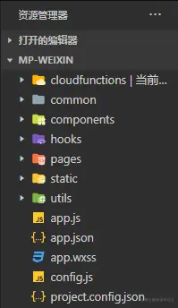

## 集成小程序的云函数开发

选择了微信小程序云开发作为后端，有如下两个缺点：
- 使用了微信小程序云开发后，uniapp 只适用于编译成微信小程序，失去了跨端的能力。
- uniapp 使用云开发并不方便，尤其是使用了 typescript 后需要做大量的额外配置。

首先我们在 `src` 目录下创建一个新的目录 `src/cloudfuntioncs` 用于存放我们的云函数，当你创建后我们会发现，这个目录在编译后并没有在微信开发工具中出现，也就意味着并没有被编译到最终产物中。

这个原因是由于云函数文件夹并没有被其他的文件所引用，因此 `vite` 进行编译时会并不会将这个 `cloudfuntioncs` 这个目录打包到产物中，因此我们需要自己将这个文件给复制出来。这一步我使用的是 `rollup-plugin-copy` 这个 rollup 插件。

1. 首先安装 `rollup-plugin-copy`
    ```bash
    npm i -D rollup-plugin-copy
    ```
2. 接着在 `vite.config.ts` 中配置一下需要复制的目录:
    ```typescript
    import { defineConfig } from 'vite'
    import uni from '@dcloudio/vite-plugin-uni'
    import copy from 'rollup-plugin-copy'
    import path from 'path'

    export default defineConfig({
      plugins: [copy({
        targets: [
          {
            src: 'src/cloudfunctions/**/*',
            dest: `dist/${process.env.NODE_ENV === 'production' ? 'build' : 'dev'}/${process.env.UNI_PLATFORM}/cloudfunctions`
          }
        ]
      }), uni()],
      resolve: {
        alias: {
          '@': path.resolve(__dirname, 'src')
        }
      }
    })
    ```

这一步我使用了环境变量去动态复制 `cloudfunctions` 目录到开发或者生产的目录位置。配置完成后我们就可以看到 `cloudfunctions` 目录在微信开发工具也能看到了。



## 其他组件库接入
[参考文章](https://juejin.cn/post/7128218112360448030)

[引入tailwind.css](https://github.com/dcasia/mini-program-tailwind)